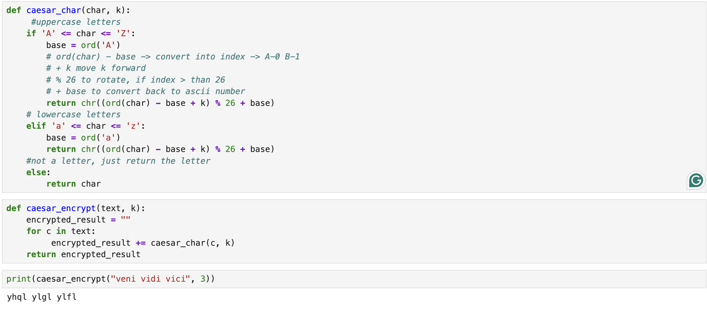
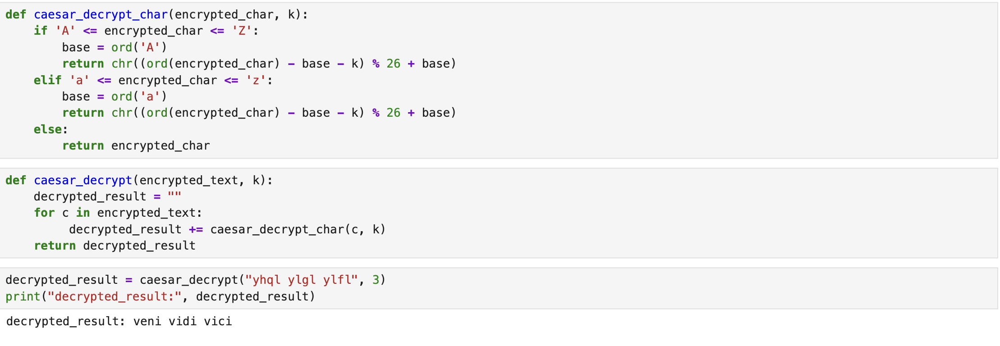
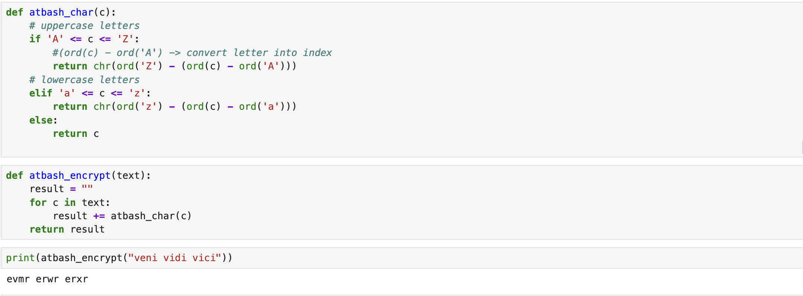
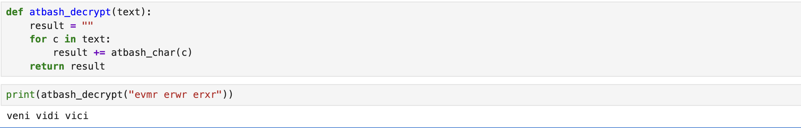

---
## Hero
lang: ru-RU
title: Шифры простой замены
author: Хамза хуссен
institute: Российский Университет Дружбы Народов
date: 16 марта 2026, Москва, Россия

## Formatting
mainfont: PT Serif
romanfont: PT Serif
sansfont: PT Sans
monofont: PT Mono
toc: false
slide_level: 2
theme: metropolis
header-includes: 
 - \metroset{progressbar=frametitle,sectionpage=progressbar,numbering=fraction}
 - '\makeatletter'
 - '\makeatother'
 - \definecolor{headerbg}{HTML}{0A1A33}
 - \definecolor{progressbarcolor}{HTML}{FF8C00}
 - \setbeamercolor{frametitle}{bg=headerbg}
 - \setbeamercolor{progress bar}{fg=progressbarcolor}
aspectratio: 43
section-titles: true
fonttheme: professionalfonts

---

# Цель работы

Изучение и практическое применение методов программной реализации шифров простой замены.

# Задание

1. Реализовать шифр Цезаря с произвольным ключом к
2. Реализовать шифр Атбаш.

# Теоретическое введение

## Шифр Цезаря

1. Шифр Цезаря ( также он является шифром простой замены ) - это
моноалфавитная подстановка, т . е . каждой букве открытого текста ставится в
соответствие одна буква шифртекста
например заменяется в сообщении первую букву латинского алфавита (А ) на
четвертую (D), вторую (В ) - на пятую (E), наконец, последнюю - на третью:

| A | B | C | D | E | F | G | H | I | J | K | L | M | N | O | P | Q | R | S | T | U | V | W | X | Y | Z |
|---|---|---|---|---|---|---|---|---|---|---|---|---|---|---|---|---|---|---|---|---|---|---|---|---|---|
| D | E | F | G | H | I | J | K | L | M | N | O | P | Q | R | S | T | U | V | W | X | Y | Z | A | B | C |

## Шифр Атбаш

2. Шифр Атбаш является шифром сдвига на всю длину алфавита. Для
алфавита, состоящего только из русских букв и пробела, таблица шифрования
будет иметь следующий вид:

| а | б | в | г | д | е | ж | з | и | й | к | л | м | н | о | п | р | с | т | у | ф | х | и | ч | и | ш | ь | ы | е | ю | я |
|---|---|---|---|---|---|---|---|---|---|---|---|---|---|---|---|---|---|---|---|---|---|---|---|---|---|---|---|---|---|---|
| я | Ю | С | ь | ы | щ | и | ч | ц | х | ф | у | т | с | р | п | о | н | м | л | к | й | и | з | ж | е | д | г | в | б | а |

# Выполнение лабораторной работы

## Выполнение лабораторной работы - Шифр Цезаря 

## Выполнение лабораторной работы - Шифр Цезаря

## Выполнение лабораторной работы - Шифр Атбаш

## Выполнение лабораторной работы - Шифр Атбаш

# Выводы

Изученил и разработал методоы программной реализации шифров простой замены.

# Список литературы{.unnumbered}
https://en.wikipedia.org/wiki/Caesar_cipher
https://en.wikibooks.org/wiki/Cryptography/Atbash_cipher

