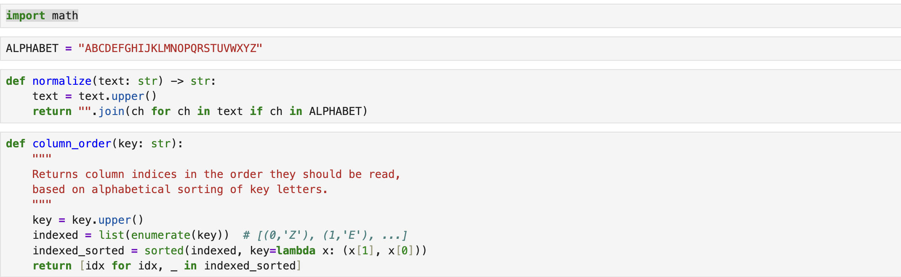
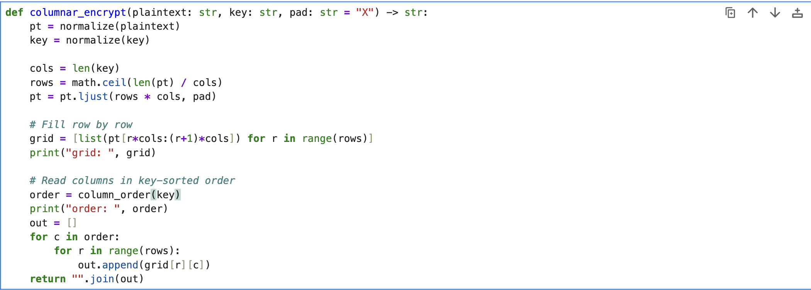
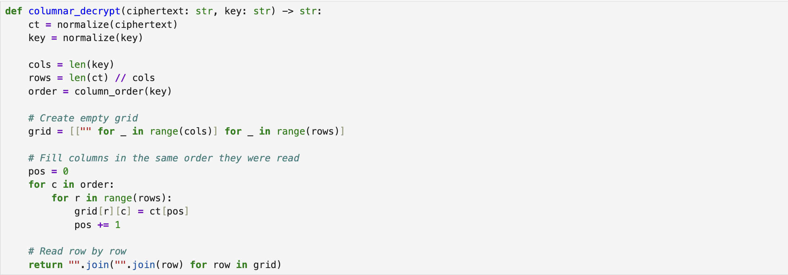
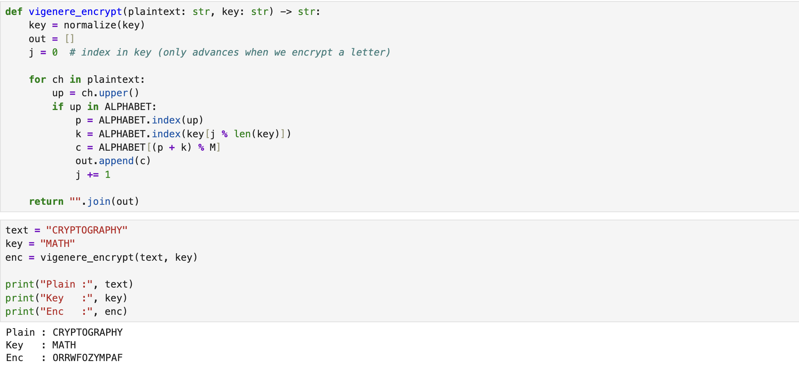
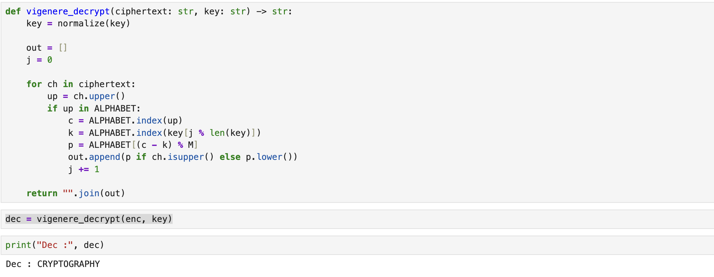

---
## Hero
lang: ru-RU
title: Шифры перестановки
author: Хамза хуссен
institute: Российский Университет Дружбы Народов
date: 16 марта 2026, Москва, Россия

## Formatting
mainfont: PT Serif
romanfont: PT Serif
sansfont: PT Sans
monofont: PT Mono
toc: false
slide_level: 2
theme: metropolis
header-includes: 
 - \metroset{progressbar=frametitle,sectionpage=progressbar,numbering=fraction}
 - '\makeatletter'
 - '\makeatother'
 - \definecolor{headerbg}{HTML}{0A1A33}
 - \definecolor{progressbarcolor}{HTML}{FF8C00}
 - \setbeamercolor{frametitle}{bg=headerbg}
 - \setbeamercolor{progress bar}{fg=progressbarcolor}
aspectratio: 43
section-titles: true
fonttheme: professionalfonts

---

# Цель работы

Изучение и практическое применение методов программной реализации шифров перестановки

# Задание

1. Реализовать Маршрутное шифрование
2. Реализовать Таблицу Виженера.

# Теоретическое введение

## Маршрутное шифрование

1. Например, для шифрования текста нельзя недооценивать противника,
разобьем его на блоки длины п = 6. Блоков получится т = 5 . К последнему
блоку припишем букву а. В качестве пароля выберем слово пароль. Теперь будем
выписывать буквы по столбцам в соответствии с алфавитным порядком букв
пароля и получим следующую криптограмму: ЕНПНЗОАТАБОВОКННЕЬВЯЦТИА.

| Н | Е | Л | Ь | З | Я |
|:-:|:-:|:-:|:-:|:-:|:-:|
| Н | Е | Д | О | О | Ц |
| Е | Н | И | В | А | Т |
| Ь | П | Р | О | Т | И |
| В | Н | И | К | А | А |
| П | А | Р | О | Л | Ь |

## Таблица Виженера

2. Открытый текст разбивается на блоки длины п. Ключ представляет собой
последовательность из п натуральных чисел: а1, аг, ...,Qn. Далее в каждом блоке
первая буква циклически сдвигается вправо по алфавиту на а з позиций, вторая
буква - на аг позиций, последняя - н а а л позиций. Для лучшего запоминания в
качестве ключа можно взять осмысленное слово, а алфавитные номера входящих
в него букв использовать для осуществления сдвигов. Например открытый текст CRYPTOGRAPHY и ключ MATH, получим : ORRWFOZYMPAF

| C | R | Y | P | T | O | G | R | A | P | H | Y |
|---|---|---|---|---|---|---|---|---|---|---|---|
| M | A | T | H | M | A | T | H | M | A | T | H |

## Таблица Виженера
|   | A | B | C | D | E | F | G | H | I | J | K | L | M | N | O | P | Q | R | S | T | U | V | W | X | Y | Z |
|---|---|---|---|---|---|---|---|---|---|---|---|---|---|---|---|---|---|---|---|---|---|---|---|---|---|---|
| A | A | B | C | D | E | F | G | H | I | J | K | L | M | N | O | P | Q | R | S | T | U | V | W | X | Y | Z |
| B | B | C | D | E | F | G | H | I | J | K | L | M | N | O | P | Q | R | S | T | U | V | W | X | Y | Z | A |
| C | C | D | E | F | G | H | I | J | K | L | M | N | O | P | Q | R | S | T | U | V | W | X | Y | Z | A | B |
| D | D | E | F | G | H | I | J | K | L | M | N | O | P | Q | R | S | T | U | V | W | X | Y | Z | A | B | C |
| E | E | F | G | H | I | J | K | L | M | N | O | P | Q | R | S | T | U | V | W | X | Y | Z | A | B | C | D |
| F | F | G | H | I | J | K | L | M | N | O | P | Q | R | S | T | U | V | W | X | Y | Z | A | B | C | D | E |
| G | G | H | I | J | K | L | M | N | O | P | Q | R | S | T | U | V | W | X | Y | Z | A | B | C | D | E | F |
| H | H | I | J | K | L | M | N | O | P | Q | R | S | T | U | V | W | X | Y | Z | A | B | C | D | E | F | G |
| I | I | J | K | L | M | N | O | P | Q | R | S | T | U | V | W | X | Y | Z | A | B | C | D | E | F | G | H |
| J | J | K | L | M | N | O | P | Q | R | S | T | U | V | W | X | Y | Z | A | B | C | D | E | F | G | H | I |
| K | K | L | M | N | O | P | Q | R | S | T | U | V | W | X | Y | Z | A | B | C | D | E | F | G | H | I | J |
| L | L | M | N | O | P | Q | R | S | T | U | V | W | X | Y | Z | A | B | C | D | E | F | G | H | I | J | K |
| M | M | N | O | P | Q | R | S | T | U | V | W | X | Y | Z | A | B | C | D | E | F | G | H | I | J | K | L |
| N | N | O | P | Q | R | S | T | U | V | W | X | Y | Z | A | B | C | D | E | F | G | H | I | J | K | L | M |
| O | O | P | Q | R | S | T | U | V | W | X | Y | Z | A | B | C | D | E | F | G | H | I | J | K | L | M | N |
| P | P | Q | R | S | T | U | V | W | X | Y | Z | A | B | C | D | E | F | G | H | I | J | K | L | M | N | O |
| Q | Q | R | S | T | U | V | W | X | Y | Z | A | B | C | D | E | F | G | H | I | J | K | L | M | N | O | P |
| R | R | S | T | U | V | W | X | Y | Z | A | B | C | D | E | F | G | H | I | J | K | L | M | N | O | P | Q |
| S | S | T | U | V | W | X | Y | Z | A | B | C | D | E | F | G | H | I | J | K | L | M | N | O | P | Q | R |
| T | T | U | V | W | X | Y | Z | A | B | C | D | E | F | G | H | I | J | K | L | M | N | O | P | Q | R | S |
| U | U | V | W | X | Y | Z | A | B | C | D | E | F | G | H | I | J | K | L | M | N | O | P | Q | R | S | T |
| V | V | W | X | Y | Z | A | B | C | D | E | F | G | H | I | J | K | L | M | N | O | P | Q | R | S | T | U |
| W | W | X | Y | Z | A | B | C | D | E | F | G | H | I | J | K | L | M | N | O | P | Q | R | S | T | U | V |
| X | X | Y | Z | A | B | C | D | E | F | G | H | I | J | K | L | M | N | O | P | Q | R | S | T | U | V | W |
| Y | Y | Z | A | B | C | D | E | F | G | H | I | J | K | L | M | N | O | P | Q | R | S | T | U | V | W | X |
| Z | Z | A | B | C | D | E | F | G | H | I | J | K | L | M | N | O | P | Q | R | S | T | U | V | W | X | Y |

# Выполнение лабораторной работы

## Маршрутное шифрование

## Маршрутное шифрование

Cipher: SUEAEYWTNSTEENDTENMOEITEUTRMHM

## Маршрутное шифрование

Back : WEMUSTNOTUNDERESTIMATETHEENEMY

## шифрование Виженера

## шифрование Виженера

# Выводы

Изученил и разработал методоы программной реализации шифров перестановки.

# Список литературы{.unnumbered}
[1] https://en.wikipedia.org/wiki/Transposition_cipher

[2] https://en.wikipedia.org/wiki/Vigen%C3%A8re_cipher

