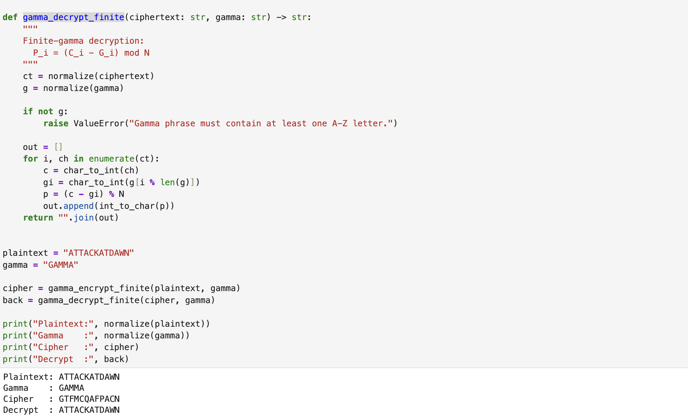

---
## Hero
lang: ru-RU
title: Шифрование гаммированием
author: Хамза хуссен
institute: Российский Университет Дружбы Народов
date: 16 марта 2026, Москва, Россия

## Formatting
mainfont: PT Serif
romanfont: PT Serif
sansfont: PT Sans
monofont: PT Mono
toc: false
slide_level: 2
theme: metropolis
header-includes: 
 - \metroset{progressbar=frametitle,sectionpage=progressbar,numbering=fraction}
 - '\makeatletter'
 - '\makeatother'
 - \definecolor{headerbg}{HTML}{0A1A33}
 - \definecolor{progressbarcolor}{HTML}{FF8C00}
 - \setbeamercolor{frametitle}{bg=headerbg}
 - \setbeamercolor{progress bar}{fg=progressbarcolor}
aspectratio: 43
section-titles: true
fonttheme: professionalfonts

---

# Цель работы

Изучение и практическое применение методов программной реализации алгоритма шифрования гаммированием конечной гаммой.

# Задание

1. Реализовать алгоритм шифрования гаммированием конечной гаммой.

# Теоретическое введение

# Выполнение лабораторной работы

## гаммированием

## гаммированием

# Выводы

Изученил и разработал методоы программной реализации алгоритма шифрования гаммированием конечной гаммой.

# Список литературы{.unnumbered}
https://en.wikipedia.org/wiki/XOR_cipher
