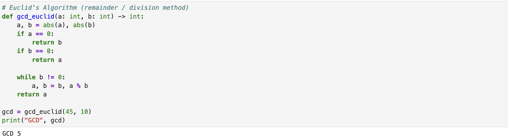
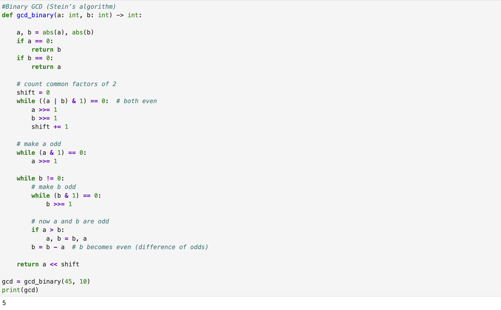
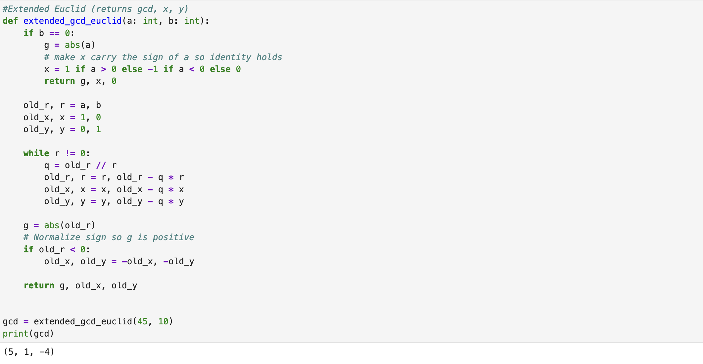
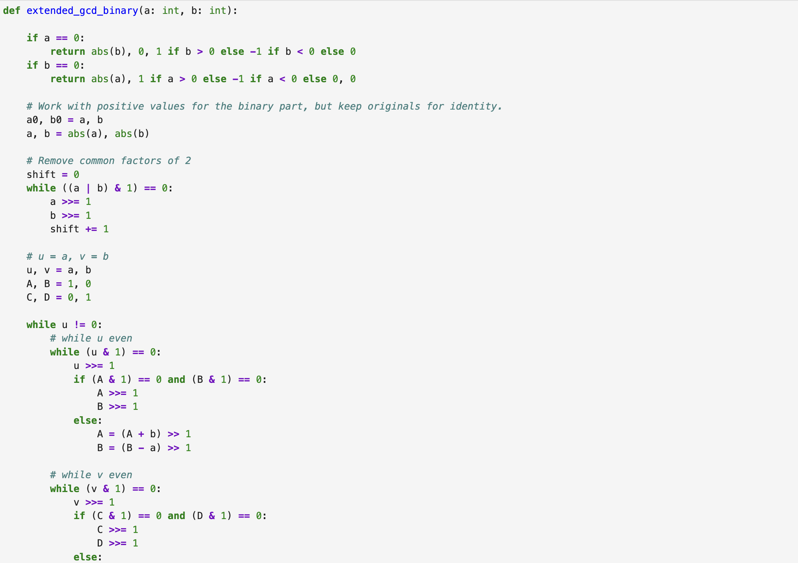
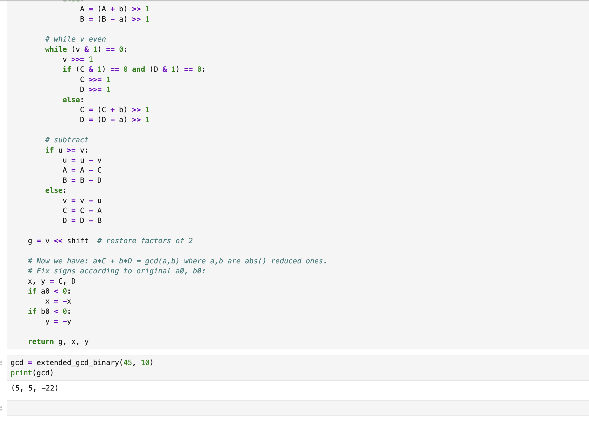

---
## Hero
lang: ru-RU
title: Вычисление наибольшего общего делителя
author: Хамза хуссен
institute: Российский Университет Дружбы Народов
date: 16 марта 2026, Москва, Россия

## Formatting
mainfont: PT Serif
romanfont: PT Serif
sansfont: PT Sans
monofont: PT Mono
toc: false
slide_level: 2
theme: metropolis
header-includes: 
 - \metroset{progressbar=frametitle,sectionpage=progressbar,numbering=fraction}
 - '\makeatletter'
 - '\makeatother'
 - \definecolor{headerbg}{HTML}{0A1A33}
 - \definecolor{progressbarcolor}{HTML}{FF8C00}
 - \setbeamercolor{frametitle}{bg=headerbg}
 - \setbeamercolor{progress bar}{fg=progressbarcolor}
aspectratio: 43
section-titles: true
fonttheme: professionalfonts

---

# Цель работы

Изучение и практическое применение методов программной реализации Алгоритмов вычисления наибольшего общего делителя.

# Задание

1. Реализовать алгоритм Евклида.
2. Реализовать бинарный алгоритм Евклида.
3. Реализовать расширенный алгоритм Евклида.
4. Реализовать расширенный бинарный алгоритм Евклида.

# Выполнение лабораторной работы

## алгоритм Евклида

## Бинарный алгоритм Евклида

## Расширенный алгоритм Евклида.

## Расширенный бинарный алгоритм Евклида.

## Расширенный бинарный алгоритм Евклида.

# Выводы

Изученил и разработал методоы программной реализации Алгоритмов вычисления наибольшего общего делителя.

# Список литературы{.unnumbered}
https://en.wikipedia.org/wiki/Euclidean_algorithm
