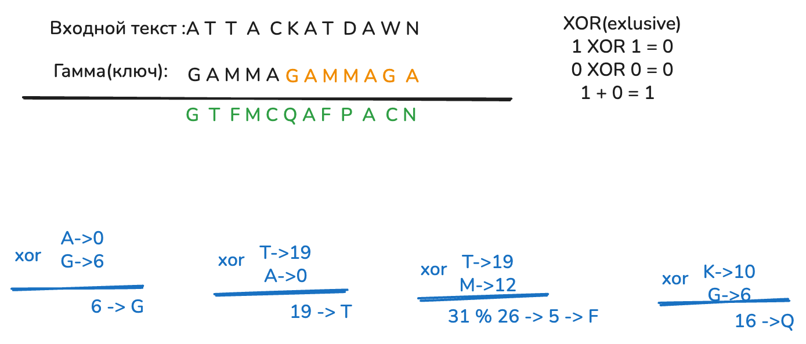

---
## Author
author:
  name: Хамза хуссен
  degrees: Магистран
  email: 1132255618@rudn.ru 
  affiliation:
    - name: Российский университет дружбы народов
      country: Российская Федерация
      postal-code: 117193
      city: Москва
      address: ул. Миклухо-Маклая, д. 13

## Title
title: "ЛАБОРАТОРНАЯ РАБОТА Nº5"
subtitle: "Вероятностные алгоритмы проверки чисел на простоту"
license: "CC BY"
---

# Цель работы

Изучение и практическое применение методов программной реализации Вероятностных алгоритмов проверки чисел на простоту.

# Задание

1. Реализовать алгоритм ест Ферма.
2. Алгоритм вычисления символа Якоби.
3ю Алгоритм, реализующий тест Соловэя-Штрассена.

# Теоретическое введение



# Выполнение лабораторной работы

## гаммированием
```{python}
ALPHABET = "ABCDEFGHIJKLMNOPQRSTUVWXYZ"
N = len(ALPHABET)

def normalize(text: str) -> str:
    text = text.upper()
    return "".join(ch for ch in text if ch in ALPHABET)

def char_to_int(ch: str) -> int:
    return ALPHABET.index(ch)

def int_to_char(x: int) -> str:
    return ALPHABET[x % N]

def gamma_encrypt_finite(plaintext: str, gamma: str) -> str:
    """
    Finite-gamma (phrase) encryption:
      C_i = (P_i + G_i) mod N
    Gamma is repeated to match plaintext length.
    """
    pt = normalize(plaintext)
    g = normalize(gamma)

    out = []
    for i, ch in enumerate(pt):
        p = char_to_int(ch)
        gi = char_to_int(g[i % len(g)])
        c = (p + gi) % N
        out.append(int_to_char(c))
    return "".join(out)

def gamma_decrypt_finite(ciphertext: str, gamma: str) -> str:
    """
    Finite-gamma decryption:
      P_i = (C_i - G_i) mod N
    """
    ct = normalize(ciphertext)
    g = normalize(gamma)

    out = []
    for i, ch in enumerate(ct):
        c = char_to_int(ch)
        gi = char_to_int(g[i % len(g)])
        p = (c - gi) % N
        out.append(int_to_char(p))
    return "".join(out)


plaintext = "ATTACKATDAWN"
gamma = "GAMMA"

cipher = gamma_encrypt_finite(plaintext, gamma)
back = gamma_decrypt_finite(cipher, gamma)

print("Plaintext:", normalize(plaintext))
print("Gamma    :", normalize(gamma))
print("Cipher   :", cipher)
print("Decrypt  :", back)

```

# Выводы

Изученил и разработал методоы программной реализации алгоритма шифрования гаммированием конечной гаммой.

# Список литературы{.unnumbered}
https://en.wikipedia.org/wiki/XOR_cipher

