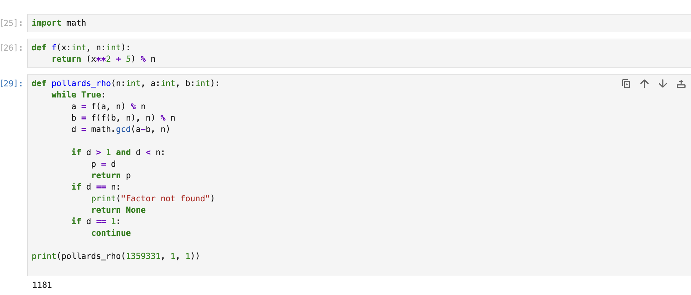

---
## Hero
lang: ru-RU
title: Разложение чисел на множители
author: Хамза хуссен
institute: Российский Университет Дружбы Народов
date: 16 марта 2026, Москва, Россия

## Formatting
mainfont: PT Serif
romanfont: PT Serif
sansfont: PT Sans
monofont: PT Mono
toc: false
slide_level: 2
theme: metropolis
header-includes: 
 - \metroset{progressbar=frametitle,sectionpage=progressbar,numbering=fraction}
 - '\makeatletter'
 - '\makeatother'
 - \definecolor{headerbg}{HTML}{0A1A33}
 - \definecolor{progressbarcolor}{HTML}{FF8C00}
 - \setbeamercolor{frametitle}{bg=headerbg}
 - \setbeamercolor{progress bar}{fg=progressbarcolor}
aspectratio: 43
section-titles: true
fonttheme: professionalfonts

---

# Цель работы

Изучение и практическое применение методов программной реализации алгоритма разложения чисел на множители.

# Задание

1. Реализовать Алгоритм $\rho$-метод Полларда
2. Разложить на множители данное преподавателем число.

<!-- # Теоретическое введение -->

## Алгоритм, реализующий $\rho$-метод Полларда

**Вход:** число `n`, начальное значение `c`, функция `f`, обладающая сжимающими свойствами.  
**Выход:** нетривиальный делитель числа `n`.

1. Положить `a <- c`, `b <- c`.
2. Вычислить `a <- f(a) (mod n)`, `b <- f(f(b)) (mod n)`.
3. Найти `d = gcd(a - b, n)`.
4. Если `1 < d < n`, то результат: `d`.  
   Если `d = n`, результат: «Делитель не найден».  
   Если `d = 1`, вернуться на шаг 2.

## Пример

Найти $\rho$-метод Полларда нетривиальный делитель числа `n = 1359331`.  
Положим `c = 1` и `f(x) = x^2 + 5 (mod n)`.

Работа алгоритма:

| i | a       | b       | d = gcd(a − b, n) |
|---|---------|---------|------------------|
| 1 | 1       | 1       | 1 |
| 2 | 6       | 41      | 1 |
| 3 | 41      | 123939  | 1 |
| 4 | 1686    | 391594  | 1 |
| 5 | 123939  | 438157  | 1 |
| 6 | 435426  | 582738  | 1 |
| 7 | 391594  | 1144026 | 1 |
| 8 | 1090062 | 885749  | 1181 |

Таким образом, `1181` является нетривиальным делителем числа `1359331`.

# Выполнение лабораторной работы

## $\rho$-метод Полларда

# Выводы

Изученил и разработал методоы программной реализации алгоритма разложения чисел на множители.

# Список литературы{.unnumbered}
https://en.wikipedia.org/wiki/Pollard%27s_rho_algorithm
