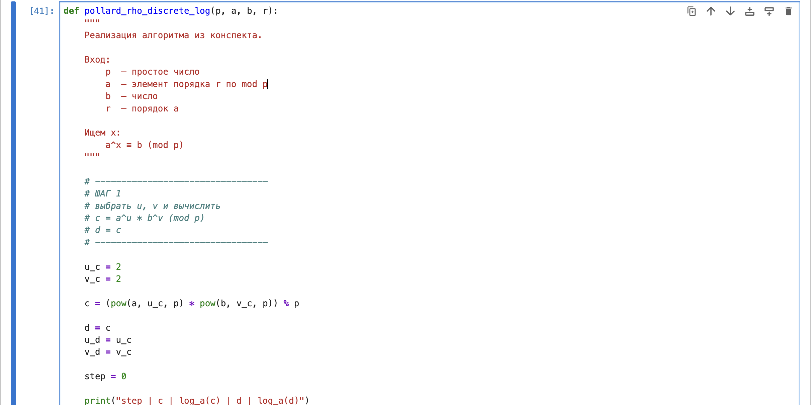
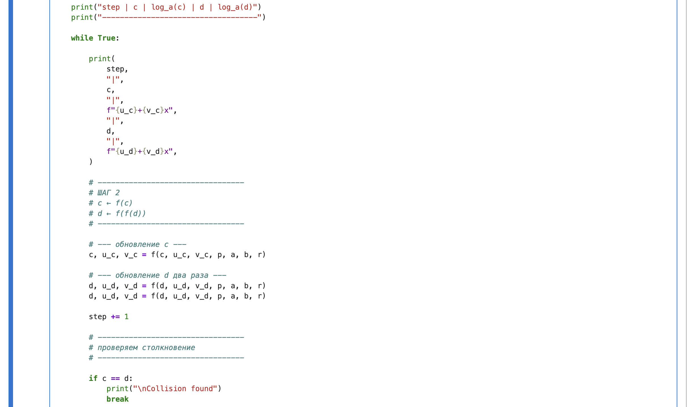

---
## Hero
lang: ru-RU
title: Дискретное логарифмирование в конечном поле
author: Хамза хуссен
institute: Российский Университет Дружбы Народов
date: 16 марта 2026, Москва, Россия

## Formatting
mainfont: PT Serif
romanfont: PT Serif
sansfont: PT Sans
monofont: PT Mono
toc: false
slide_level: 2
theme: metropolis
header-includes: 
 - \metroset{progressbar=frametitle,sectionpage=progressbar,numbering=fraction}
 - '\makeatletter'
 - '\makeatother'
 - \definecolor{headerbg}{HTML}{0A1A33}
 - \definecolor{progressbarcolor}{HTML}{FF8C00}
 - \setbeamercolor{frametitle}{bg=headerbg}
 - \setbeamercolor{progress bar}{fg=progressbarcolor}
aspectratio: 43
section-titles: true
fonttheme: professionalfonts

---

# Цель работы

Реализация алгоритм, $\rho$-метод Полларда для вычисления дискретного логарифма.

# Задание

1. Реализовать алгоритм, $\rho$-метод Полларда для вычисления дискретного логарифма.

# Теоретическое введение

Обозначим Fp = Z/p2, р - простое целое число и назовем конечным полем
из р элементов. Задача дискретного логарифмирования в конечном поле *р
формулируется так: для данных целых чисел а и b , а > 1,b > р, найти логарифм
- такое целое число х , что $a^x \equiv b \pmod{p}$ (если такое число существует). По
аналогии с вещественными числами используется обозначение х = loga b

## $\rho$-метод для задач дискретного логарифмирования.

Вход. Простое число р, число а порядка г п о модулю р, целое число b, 1 < b < p;
отображение f, обладающее сжимающими свойствами и сохраняющее
вычислимость логарифма.

Выход. Показатель х, для которого $a^x \equiv b \pmod{p}$, если такой показатель
существует.

## $\rho$-метод для задач дискретного логарифмирования

1. Выбрать произвольные целые числа u, v и положить с <- a^u b^v (mod p), d <- c.
2. Выполнять с <- f (c) (mod p), d <- f (f(d)) (mod p), вычисляя при этом
логарифмы для с и d как линейные функции от х по модулю r, до получения
равенства $c \equiv d \pmod{p}$

## $\rho$-метод для задач дискретного логарифмирования.
3. Приравняв логарифмы для с и d, вычислить логарифм х решением сравнения
по модулю г. Результат: х или "Решений нет".

## Пример

Пример. Решим задачу дискретного логарифмирования 10* = 6 4 (mod 107),
используя р-Метод Полларда. Порядок числа 10 по модулю 107 равен 53.
Выберем
64c (mod 107) при с ≥ 53. Пусть и = 2 , v = 2 . Результаты вычислений запишем
в таблицу:

| Номер шага | c  | log_a c | d  | log_a d |
|-------------|----|---------|----|---------|
| 0  | 4  | 2+2x | 4  | 2+2x |
| 1  | 40 | 3+2x | 76 | 4+2x |
| 2  | 79 | 4+2x | 56 | 5+3x |
| 3  | 27 | 4+3x | 75 | 5+5x |
| 4  | 56 | 5+3x | 3  | 5+7x |
| 5  | 53 | 5+4x | 86 | 7+7x |
| 6  | 75 | 5+5x | 42 | 8+8x |
| 7  | 92 | 5+6x | 23 | 9+9x |
| 8  | 3  | 5+7x | 53 | 11+9x |
| 9  | 30 | 6+7x | 92 | 11+11x |
| 10 | 86 | 7+7x | 30 | 12+12x |
| 11 | 47 | 7+8x | 47 | 13+13x |

Приравниваем логарифмы, полученные н а 11-м шаге:
7+8 x =13+13 x (mod 53). Решая сравнение первой степени, получаем: х = 20(mod 53).

Проверка: 10^20 = 64 (mod 107).

# Выполнение лабораторной работы

## Extended_gcd

## Mod_inverse

## Отображение f

## Pollard_rho_discrete_log

## Pollard_rho_discrete_log

## Test

## Result

# Выводы

Реализовал алгоритм, $\rho$-метод Полларда для вычисления дискретного логарифма.

# Список литературы{.unnumbered}
https://en.wikipedia.org/wiki/Pollard%27s_rho_algorithm
