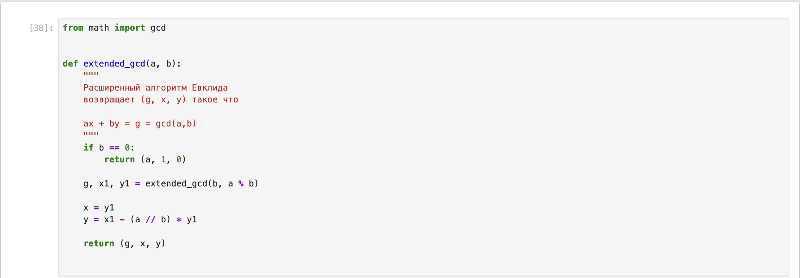
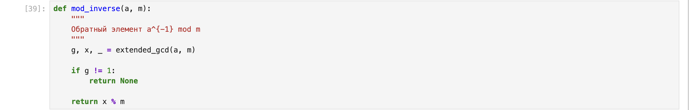
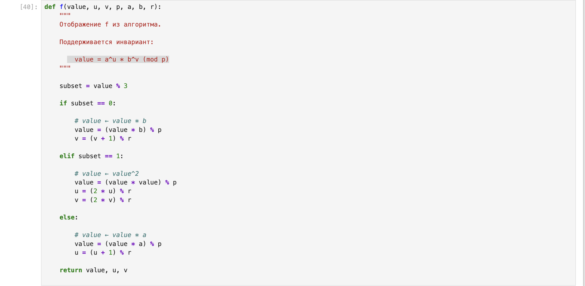
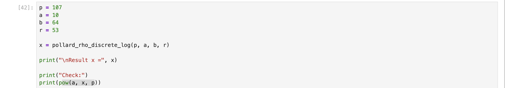

---
## Author
author:
  name: Хамза хуссен
  degrees: Магистран
  email: 1132255618@rudn.ru 
  affiliation:
    - name: Российский университет дружбы народов
      country: Российская Федерация
      postal-code: 117124
      city: Москва
      address: ул. Миклухо-Маклая, д. 13

## Title
title: "ЛАБОРАТОРНАЯ РАБОТА Nº7"
subtitle: "Дискретное логарифмирование в конечном поле"
license: "CC BY"
---

# Цель работы

Реализация алгоритм, $\rho$-метод Полларда для вычисления дискретного логарифма.

# Задание

1. Реализовать алгоритм, $\rho$-метод Полларда для вычисления дискретного логарифма.

# Теоретическое введение

Обозначим Fp = Z/p2, р - простое целое число и назовем конечным полем
из р элементов. Задача дискретного логарифмирования в конечном поле *р
формулируется так: для данных целых чисел а и b , а > 1,b > р, найти логарифм
- такое целое число х , что а^x = b (mod p) (если такое число существует). По
аналогии с вещественными числами используется обозначение х = loga b

## Алгорити, реализующий  $\rho$-метод Полларда для задач дискретного логарифмирования.

Вход. Простое число р, число а порядка г п о модулю р, целое число b, 1 < b < p;
отображение f, обладающее сжимающими свойствами и сохраняющее
вычислимость логарифма.

Выход. Показатель х, для которого а* = b (mod p), если такой показатель
существует.

1. Выбрать произвольные целые числа u, v и положить с <- a^u b^v (mod p), d <- c.
2. Выполнять с <- f (c) (mod p), d <- f (f(d)) (mod p), вычисляя при этом
логарифмы для с и d как линейные функции от х по модулю r, до получения
равенства с = d (mod p).
3. Приравняв логарифмы для с и d, вычислить логарифм х решением сравнения
по модулю г. Результат: х или "Решений нет".

## Пример

Пример. Решим задачу дискретного логарифмирования 10* = 6 4 (mod 107),
используя р-Метод Полларда. Порядок числа 10 по модулю 107 равен 53.
Выберем
64c (mod 107) при с ≥ 53. Пусть и = 2 , v = 2 . Результаты вычислений запишем
в таблицу:

| Номер шага | c  | log_a c | d  | log_a d |
|-------------|----|---------|----|---------|
| 0  | 4  | 2+2x | 4  | 2+2x |
| 1  | 40 | 3+2x | 76 | 4+2x |
| 2  | 79 | 4+2x | 56 | 5+3x |
| 3  | 27 | 4+3x | 75 | 5+5x |
| 4  | 56 | 5+3x | 3  | 5+7x |
| 5  | 53 | 5+4x | 86 | 7+7x |
| 6  | 75 | 5+5x | 42 | 8+8x |
| 7  | 92 | 5+6x | 23 | 9+9x |
| 8  | 3  | 5+7x | 53 | 11+9x |
| 9  | 30 | 6+7x | 92 | 11+11x |
| 10 | 86 | 7+7x | 30 | 12+12x |
| 11 | 47 | 7+8x | 47 | 13+13x |

Приравниваем логарифмы, полученные н а 11-м шаге:
7+8 x =13+13 x (mod 53). Решая сравнение первой степени, получаем: х = 20(mod 53).

Проверка: 10^20 = 64 (mod 107).

# Выполнение лабораторной работы

# Выводы

Реализовать алгоритм, $\rho$-метод Полларда для вычисления дискретного логарифма.

# Список литературы{.unnumbered}
https://en.wikipedia.org/wiki/Pollard%27s_rho_algorithm

