---
## Author
author:
  name: Хамза хуссен
  degrees: Магистран
  email: 1132255618@rudn.ru 
  affiliation:
    - name: Российский университет дружбы народов
      country: Российская Федерация
      postal-code: 117176
      city: Москва
      address: ул. Миклухо-Маклая, д. 13

## Title
title: "ЛАБОРАТОРНАЯ РАБОТА Nº8"
subtitle: "Целочисленная арифметика многократной точности"
license: "CC BY"
---

# Цель работы

Реализация алгоритмов многократной точности для целочисленной арифметики.

# Задание

1. Реализовать алгоритм сложения неотрицательных целых чисел.

2. Реализовать алгоритм вычитания неотрицательных целых чисел.

3. Реализовать алгоритм умножения неотрицательных целых чисел столбиком.

4. Реализовать алгоритм умножения методом быстрого столбика.

5. Реализовать алгоритм деления неотрицательных целых чисел.

# Теоретическое введение

Рассмотрим алгоритмы для выполнения арифметических
операций с большими целыми числами. Будем считать, что число записано в b -
ичной системе счисления, $b - натуральное число, b ≥ 2$. Натуральное -разрядное
число будем записывать в виде:  $u = u_1 u_2 \ldots u_n$

## Алгоритм сложения неотрицательных целых чисел

*Вход. Два неотрицательных числа $u = u_1 u_2 \ldots u_n$ и $v = v_1 v_2 \ldots v_n$; разрядность чисел $n$; основание системы счисления $b$.

*Выход. Сумма $w = w_0 w_1 \ldots w_n$, где $w_0$ - цифра переноса, всегда равная $0$ либо $1$.

1. Присвоить $j = n, k = 0$ (*$j$ идет по разрядам, $k$ следит за переносом*).
2. Присвоить $w_j = (u_j + v_j + k) \pmod{b}$, где $k = \left[ \frac{u_j + v_j + k}{b} \right]$.
3. Присвоить $j = j - 1$. Если $j > 0$, то возвращаемся на шаг 2; если $j = 0$, то присвоить $w_0 = k$ и результат: $w$.

## Алгоритм вычитания неотрицательных целых чисел

*Вход. Два неотрицательных числа $u = u_1 u_2 \ldots u_n$ и $v = v_1 v_2 \ldots v_n$, $u > v$; разрядность чисел $n$; основание системы счисления $b$.

*Выход. Разность $w = w_0 w_1 \ldots w_n = u - v$.

1. Присвоить $j = n, k = 0$ ($k$ -- заём из старшего разряда).
2. Присвоить $w_j = (u_j - v_j + k) \pmod{b}$; $k = \left[ \frac{u_j - v_j + k}{b} \right]$.
3. Присвоить $j = j - 1$. Если $j > 0$, то возвращаемся на шаг 2; если $j = 0$, то результат: $w$.

## Алгоритм умножения неотрицательных целых чисел столбиком

*Вход. Числа $u = u_1 u_2 \ldots u_n$, $v = v_1 v_2 \ldots v_m$; основание системы счисления $b$.

*Выход. Произведение $w = uv = w_1 w_2 \ldots w_{m+n}$.

1. Выполнить присвоения: $w_{m+1} = 0, w_{m+2} = 0, \ldots, w_{m+n} = 0, j = m$ (*$j$ перемещается по номерам разрядов числа $v$ от младших к старшим*).
2. Если $v_j = 0$, то присвоить $w_j = 0$ и перейти на шаг 6.
3. Присвоить $i = n, k = 0$ (*значение $i$ идет по номерам разрядов числа $u$, $k$ отвечает за перенос*).
4. Присвоить $t = u_i \cdot v_j + w_{i+j} + k, w_{i+j} = t \pmod{b}, k = \left[ \frac{t}{b} \right]$.
5. Присвоить $i = i - 1$. Если $i > 0$, то возвращаемся на шаг 4, иначе присвоить $w_j = k$.
6. Присвоить $j = j - 1$. Если $j > 0$, то вернуться на шаг 2. Если $j = 0$, то результат: $w$.

## Алгоритм умножения методом быстрого столбика

*Вход. Числа $u = u_1 u_2 \ldots u_n$, $v = v_1 v_2 \ldots v_m$; основание системы счисления $b$.

*Выход. Произведение $w = uv = w_1 w_2 \ldots w_{m+n}$.

1. Присвоить $t = 0$.
2. Для $s$ от $0$ до $m + n - 1$ с шагом 1 выполнить шаги 3 и 4.
3. Для $i$ от $0$ до $s$ с шагом 1 выполнить присвоение $t~=~t~+~u_{n - i}~\cdot~v_{m - s + i}$.
4. Присвоить $w_{m + n - s} = t \pmod{b}, t = \left[ \frac{t}{b} \right]$. Результат: $w$.

## Алгоритм деления неотрицательных целых чисел

*Вход. Числа $u = u_n \ldots u_1 u_0$, $v = v_t \ldots v_1 v_0, n \ge t \ge 1, v_t \ne 0$.

*Выход. Частное $q = q_{n-t} \ldots q_0$, остаток $r = r_t \ldots r_0$.

1. Для $j$ от $0$ до $n - t$ присвоить $q_j = 0$.
2. Пока $u \ge v b^{n - t}$, выполнять: $q_{n - t} = q_{n - t} + 1, u = u - v b^{n - t}$.
3. Для $i = n, n - 1, \ldots, t + 1$ выполнять пункты 3.1 -- 3.4:
	3.1. если $u_i \ge v_t$, то присвоить $q_{i - t - 1} = b - 1$, иначе присвоить $q_{i - t - 1} = \frac{u_i b + u_{i - 1}}{v_t}$.
	3.2. пока $q_{i - t - 1} (v_t b + v_{t - 1}) > u_i b^2 + u_{i - 1} b + u_{i - 2}$ выполнять $q_{i - t - 1} = q_{i - t - 1} - 1$.
	3.3. присвоить $u = u - q_{i - t - 1} b^{i - t - 1} v$.
	3.4. если $u < 0$, то присвоить $u = u + v b^{i - t - 1}$, $q_{i - t - 1}~=~q_{i - t - 1}~-~1$.
4. $r = u$. Результат: $q$ и $r$.

# Выполнение лабораторной работы

## Реализация Алгоритма сложения неотрицательных целых чисел

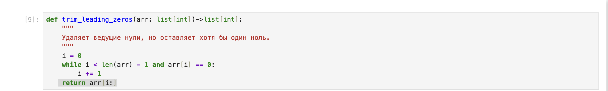

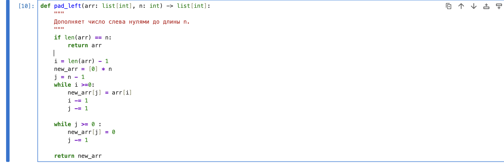

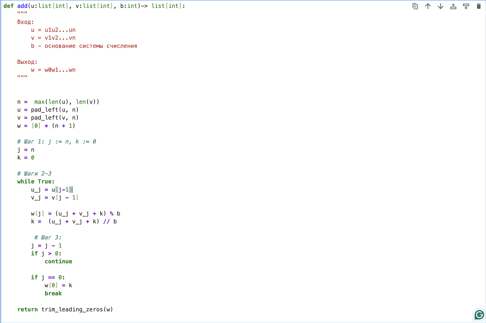

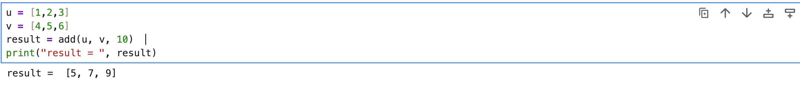

## Реализация Алгоритма вычитания неотрицательных целых чисел

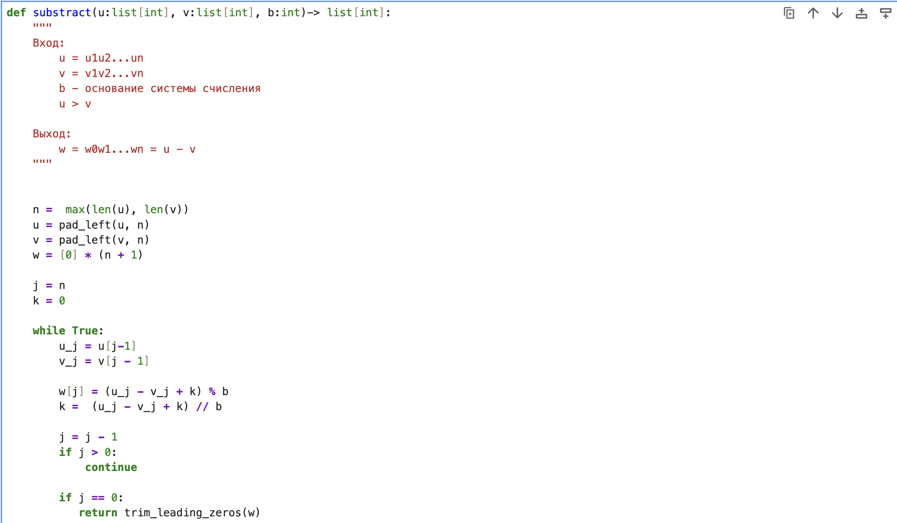

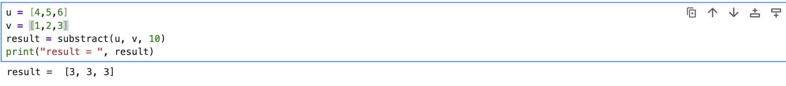

## Реализация Алгоритма умножения неотрицательных целых чисел столбиком

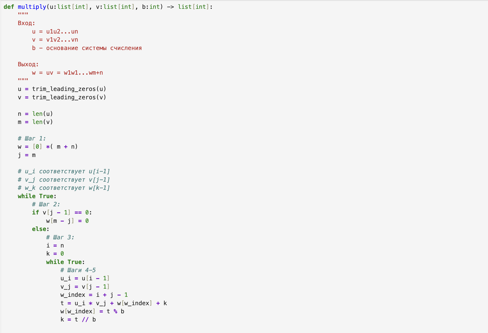

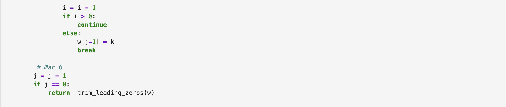

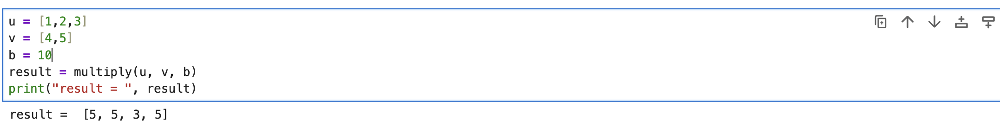

## Реализация Алгоритма умножения методом быстрого столбика

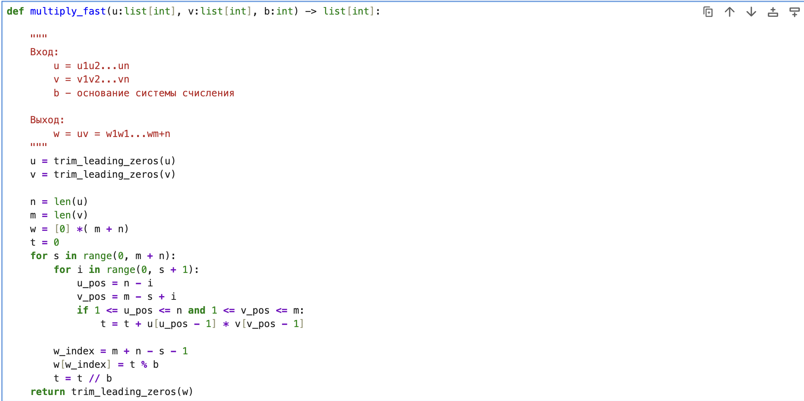

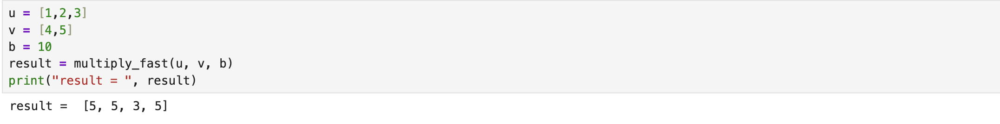

## Реализация Алгоритма деления неотрицательных целых чисел
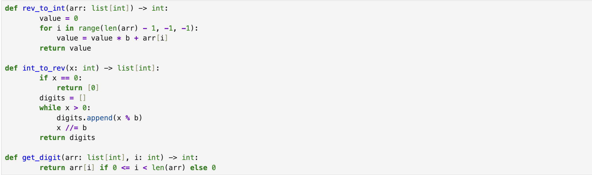

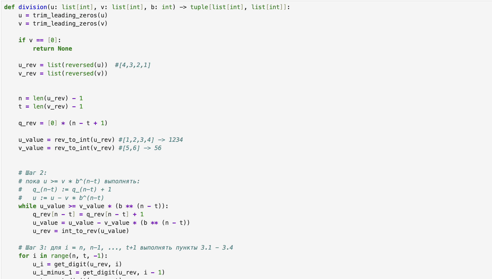

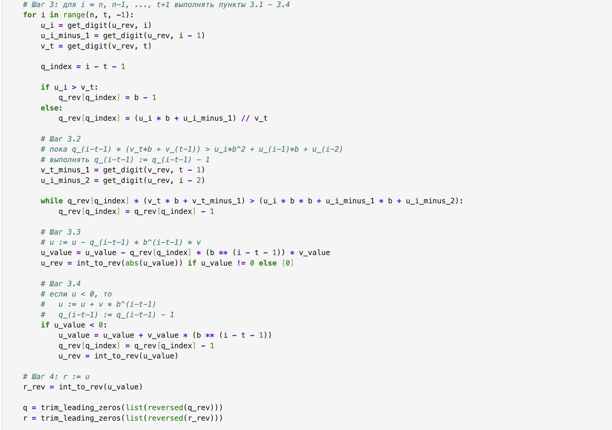

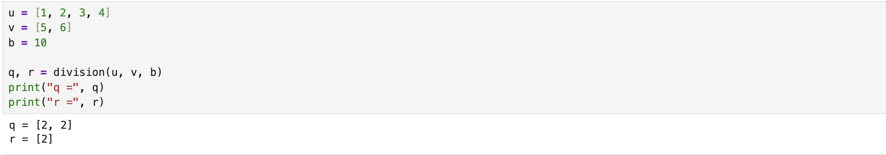

# Выводы
Реализовал алгоритмов многократной точности для целочисленной арифметики.

# Список литературы{.unnumbered}
https://en.wikipedia.org/wiki/Arbitrary-precision_arithmetic

